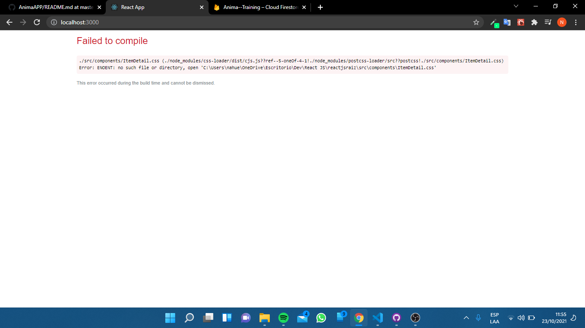

# Anima Training APP

Anima Training es un emprendimiento de grupos de entrenamientos en espacios abiertos, personalizado para cualquier persona que quiera y pueda realizar actividades fisicas.

## Creacion
    npx create-react-app reactjsraiz
## Iniciar:
    npm start

## **Componentes**

**CartContext**

clear: vacia el total de productos que haya en el carrito

addItem: agrega los productos al carritos

removeItem: recibe por props un id y setea al carrito un array filtrado.

isInCar: buscar el producto dentro del carrito y devuelve true o false.

getTotal: hace un recorrido de todos los productos del carrito y calcula el total de todos ellos.

getQuantity: realiza un conteo de la cantidad total de los productos que hay en el carrito.

## NavBar

Uso un navbar importado de Bootstrap, para hacerlo responsive, dentro de el se encuentran links hacia "Inicio", "Programas" (aca se encuentrna los productos) y "Contacto" (un formulario simple de contacto). Tambien se encuentra un icono de un carrito importado de FontIcon el cual tiene un link que lleva al carrito y que tiene un estado que cambia segun la cantidad de productos que haya dentro de el.

## Firebase

Utilizo el servicio de Google, Firebase, para crear una tabla de los productos y sus respectivos detalles que quiero mostrar en mi app. Ademas, tambien hay otra coleccion llamada "reservas" que es donde se guardaran las compras de los usuarios realicen. 

## ItemListContainer

Utilizo useState, useEffect de React para setear el estado de "programs" en "setPrograms" el cual esta dentro del useEffect.
En este componento traigo los datos de mi base de datos de Firebase. 
Tambien importo el componente ItemList y le paso por props sus datos.

## ItemList

En este componente realizo un .map de los productos para que me haga un mapeo de todos los productos que poseo, en dicho componente.

## Item

En este componente armo la Card que muestre el producto sin los detalles, solo se muestra el nombre y los dias. Utilizo solo CSS, que lo importe como "Item.css"

## ItemDetailContainer

Al igual que en ItemListContainer, utilizo useEffect, useParamas y useState, para realizar una accion similar, la diferencia es que aca lo utilizo para filtrar productos por la categoria. Consulto con la base de datos de Firebase para que me devuelva el producto segun en que categoria haya hecho click previamente (en ItemListContainer). Tambien seteo un estado condicional con "loading" y le agrego un componente llamado LoadingSpin para que, mientras los productos se esten cargando, se muestre una "rueda giratoria" hasta que los productos esten listos. Por ultimo, le paso los datos por props al componente ItemDetail

## ItemDetail

Similar al componente Item, agrego los datos del productos mediante las props, solo que aca agrego detalles del producto como el precio, los dias, el stock y la descripcion. Por ultimo, le agrego el componente ItemCount a el cual, le paso tambien por props, el stock, la cantidad y el item mismo.

## ItemCount

Aca llamo desdel CartContext las funciones de: onAddProduct(), isInCar().
Dentro del useEffect, agrego la funcion IsInCar y si la respuesta recibida es true, seteo en un estado la cantidad de productos. 
El stock que pase props, es para que, si el usuario quiere agregar mas del stock recibido, el boton de "+" no le sumara mas de dicha cantidad.
La funion onAddProduct() sirve para agregar productos al carrito.

## Home

Este componente solamente contiene un h1 que da la bienvenida a la pagina.

## CartWidget

Contiene el icono del carrito impoortado de FontAwesome y la funcion getQuantity que traigo desde el cartContext, que se utiliza para ver la cantidad de productos que hay en el carrito.

## Contacto

Este componente solo tiene un formulario simple que funciona para simular un formulario de contacto si el usuario desea despejar dudas especificas.

## Anotaciones

El componente 'ItemDetail.css' presenta un error el cual no pude resolverlo, en ningun componente se lo esta importando y al querer eliminarlo se presenta el siguiente error, y al querer moverlo a una carpeta u agregarlo a gitIgnore, el error sigue persistiendo

